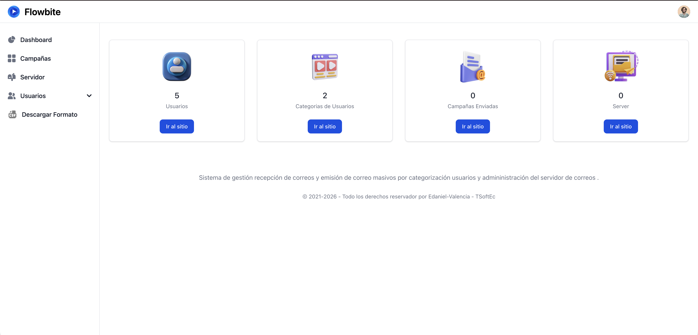

<div align="center">
  

  # Sistema de Envío de Correos Masivos - Frontend
  
  [](https://github.com/edaniel-valencia/system-for-sending-mass-emails-backend-with-angular)
</div>

## Vistas del Sistema

### Página Principal


### Panel Administrativo


## Pre-requisitos

Antes de iniciar, asegúrate de tener instalados:

- **Node.js** (versión 24.x o superior)
- **Angular CLI** (versión 22.x)
- **NPM** (incluido con Node.js)

## Configuración

1. Clona el repositorio e ingresa a la carpeta:
   ```bash
   git clone https://github.com/edaniel-valencia/system-for-sending-mass-emails-frontend-with-angular.git
   cd system-for-sending-mass-emails-frontend-with-angular
   ```

2. Instala las dependencias del proyecto:
   ```bash
   npm install
   ```

3. Configura las variables de entorno:
   - Crea un archivo `.env` en la raíz del proyecto basándote en el archivo de prueba `.env.test`.
   - Asegúrate de configurar la URL del backend correctamente en dicho archivo.

## Ejecución en Local

Para iniciar el servidor de desarrollo, ejecuta el siguiente comando:

```bash
ng serve
```
O también puedes usar:
```bash
npm run start
```

Abre tu navegador y dirígete a `http://localhost:4200/`. La aplicación se recargará automáticamente si realizas cambios en los archivos del código.
